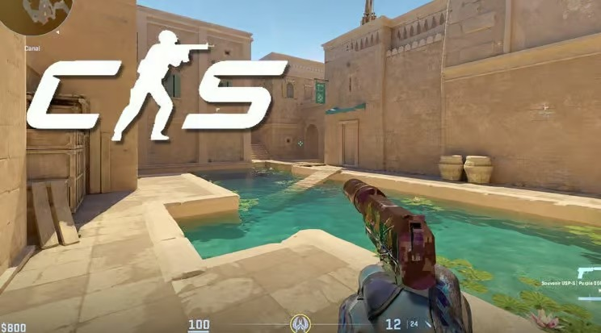
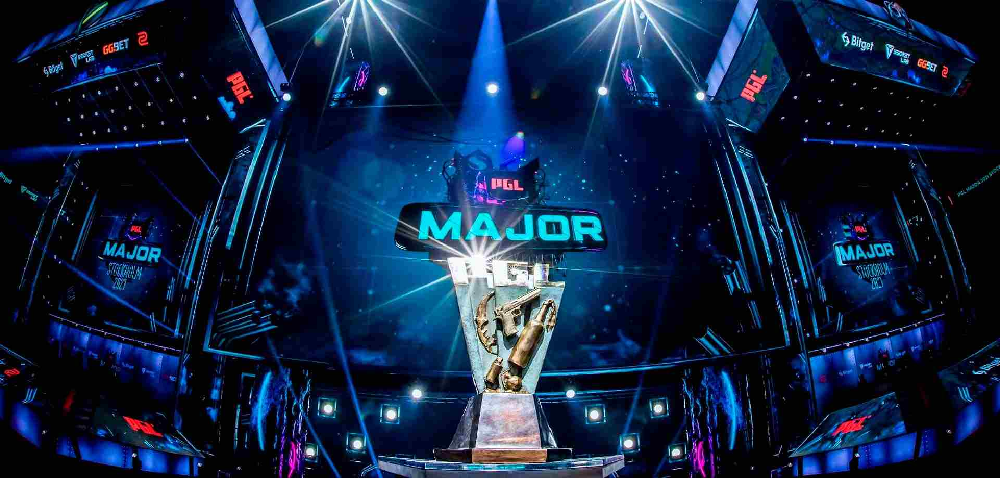
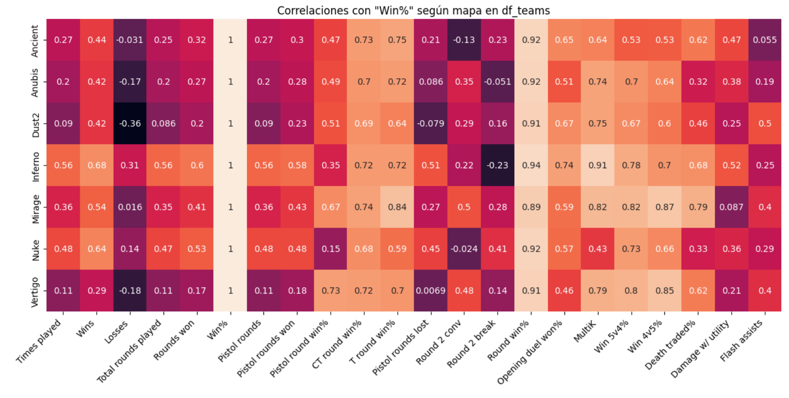
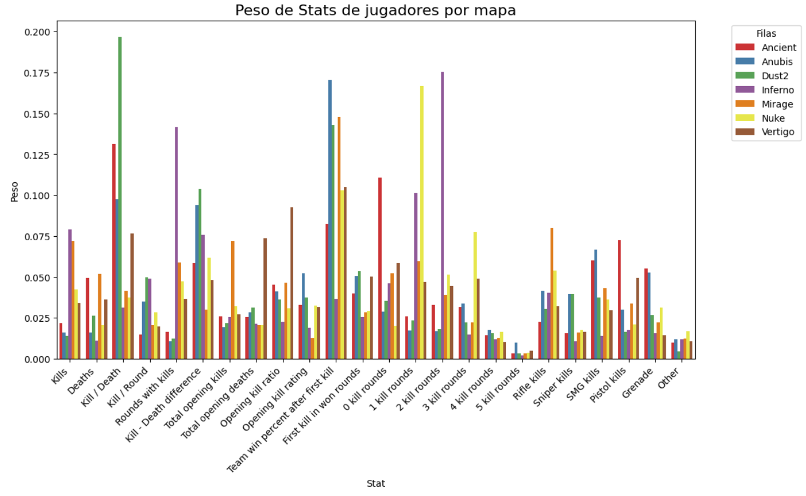
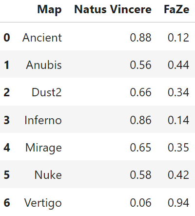

# Bienvenido/a al Proyecto

En esta página web se explicarán las principales partes del proyecto. Encontrarás una explicación general de nuestra motivación y proceso de creación del modelo, además de una explicación más extendida del proceso de extracción, transformación y limpieza de los datos; como se escogió y preparó el modelo; y una documentación sobre el uso de los principales componentes del proyecto. 

- [Datos](datos/)
- [Modelos](modelo/)
- [Documentación](documentacion/)

# Qué es Counter-Strike 2

Counter-Strike 2 (CS2) es el último juego de la saga Counter-Stike desarrollada por Valve, lanzado en 2023, CS2 al igual que sus predecesores, es un juego multijugador tactico de disparos en primera persona. En su modo de juego principal y más popular, la partidas competitivas, dos equipos de cinco jugadores cada uno, se enfrentan en una partida de 24 rondas en alguno de los 7 mapas activos, donde el primero en ganar 13 de ellas se lleva la victoria. 

Las partidas competitivas están divididas en dos mitades, en la primera mitad, uno de los equipos juega como el bando antiterrorista y el otro como el bando terrorista, y en la siguiente mitad, los equipos cambian de bandos. En cada ronda los terroristas tienen como objetivo plantar una bomba en alguno de los dos puntos especiales del mapa o bien eliminarlos a todos los antiterroristas. Por otro lado, los antiterroristas tienen como objetivo defender estos puntos por la duración de la ronda, desactivar la bomba en caso de ser plantada o bien eliminar a todos los terroristas.

El juego posee mecánicas de juego simples pero capaces de complejizar el juego enormemente, haciendo que cada partida sea única y diferente a la anterior, elevando el nivel de los jugadores mientras más tiempo jueguen. Las más destacables son:

1. La economía del juego: En cada ronda, ambos bandos reciben dinero por las acciones de la ronda anterior, con este dinero, los equipos compran su equipamiento para la ronda, incluyendo armas, grandas y armadura, en otros.
2. El patrón de dispersión de las armas: Todas y cada una de las armas disponibles para ambos bandos poseen un patrón de dispersión único cuando se disparan, dominar estos patrones ofrece una gran ventaja sobre los rivales. Además, este se ve afectado fuertemente por el movimiento, por lo que se favorece una jugabilidad pausada y metódica.

En general, el juego premia el trabajo en equipo y la buena comunicación entre sus integrantes. Gracias a esto, el juego no tan solo goza de una comunidad activa de más de 20 millones de jugadores mensules, también posee una escena profesional y donde se compite por premios millonarios.

# Escena profesional

La escena competitiva del juego es altamente profesional, con torneos internacionales y una competencia activa entre equipos de élite. 

# Motivación de la investigación

Cada año se juega el Major de Counter-Strike 2 (CS2), la competencia más importante para los equipos profesionales del videojuego, con una suma de premios de 1,250,000 $USD. Este es un evento presencial y que se transmite online con miles de espectadores. Además de los premios, el evento mueve mucho dinero a través ventas en el juego de artículos exclusivos y de mercados de la comunidad con la compra y venta de recompensas por participar en las predicciones del Major, en un mini juego dentro de CS2 conocido como “Pick'em”. También se producen apuestas en páginas externas al juego.

Debido a la gran cantidad de datos que existe de los equipo y jugadores profesionales, vimos una gran oportunidad para estudiar el funcionamiento de las apuestas y cómo éstas se ven influenciadas por las distintas a características que conforman a los equipos. Esto con el fin de poder predecir con la mayor precisión posible los resultados de los partidos entre los equipos, y así tal vez poder reconocer el campeón del Major antes de que inicie el torneo principal.

# Preguntas de Investigación

Nuestras preguntas de investigación finales utilizadas para realizar el proyecto fueron:

+ Variables que afectan en el juego:
    + ¿Qué factores del equipo son los que más influencian el resultado?
    + ¿Qué métricas de los jugadores del equipo afectan más al porcentaje de victorias del equipo?
+ Considerando selección de mapas:
    + ¿Hay cierta correlación entre los mapas elegidos y el porcentaje de victorias de cada equipo?
    + ¿Cómo varían las posibilidades de que un equipo le gane a otro dependiendo del mapa escogido?
+ Viabilidad del modelo:
    + ¿Es posible realizar un modelo de predicciones con buenas metricas utilizando datos generales de los jugadores y equipos?

# Resultados

## Relación entre variables y porcentaje de victorias

### Métricas de equipos

En esta matriz de correlación se ve como distintas métricas se relacionan de diferente manera para cada mapa con el porcentaje de victorias de los equipos.

### Metrícas de jugadores

Se logró determinar cuales son las métricas de los jugadores que, en general, influyen más en el porcentaje de victorias del equipo, y se resumieron en el siguiente gráfico:

Las estadísticas que más destacan son el ratio Kills / Deaths, la direrencia Kills - Deaths y Team win percent after firts kill.

## Modelo de predicciones

Aquí veremos los resultados generales del modelo, para más detalle en los resultado del modelo consulte [Modelos](modelo/).

### Viabilidad del modelo

Las observaciones y pruebas de modelos revelaron que era posible realizar un modelo de predicciones para CS2, utilizando solamente los datos disponible.

El modelo muestra una correlación moderada entre las estadísticas seleccionadas (como estadísticas de apertura, estadísticas generales y estadísticas de armas) y la probabilidad de victoria del equipo. Si bien los resultados muestran una capacidad de predicción razonable, se evidenció que el modelo no es completamente preciso, y existen varias áreas de mejora, como considerar cambios en el roster de los equipos, la evolución del meta, y la relevancia de cada rol específico dentro del equipo

Pese a estas limitaciones, el modelo es viable y útil, ofrece estimaciones educadas de la probabilidad de victoria en los enfrentamientos de CS2. Las métricas de precisión son lo suficientemente altas como para ser utilizadas en un contexto práctico, y el análisis sugiere que el modelo podría ser valioso como una herramienta de apoyo para la toma de decisiones estratégicas.
### Correlación entre victorias y mapas

Existe una directa relación entre el porcentaje de victorias de los equipo y el mapa escogido, esto en parte a los dos puntos anteriores, y se puede ver reflejado en las predicciones probabilistas que entrega el modelo. Veamos un ejemplo en el que se muestran las probabilidades de cada equipo de ganar un mapa en un enfrentamiento entre ellos:

    

Se observa que dadas las probabilidades estimadas por el modelo, hay una clara ventaja para un equipo dependiendo del mapa jugado. Por ejemplo,el equipo Natus Vincere tiene alta probabilidad de ganar mapas como Ancient e Inferno,mientras que Faze tiene una mayor probabilidad de ganar en Vértigo, demostrando así la relevancia que tiene la selección de mapas debido a los puntos fuertes y débiles del equipo.
# Conclusiones

El modelo de predicciones para Counter-Strike 2 (CS2) demostró ser viable, proporciona buenas estimaciones sobre las probabilidades de victoria en los enfrentamientos. La selección de mapas es un factor determinante en el resultado de los partidos, y algunas métricas de jugadores, como el ratio de bajas/muertes y la eficiencia tras la primera baja, influyen significativamente en las victorias. Sin embargo, el modelo tiene sus  limitaciones que podrían mejorarse al considerar cambios en los rosters y la evolución del meta. Aun así, ofrece un gran potencial y utilidad como herramienta de apoyo para analistas y aficionados del juego.