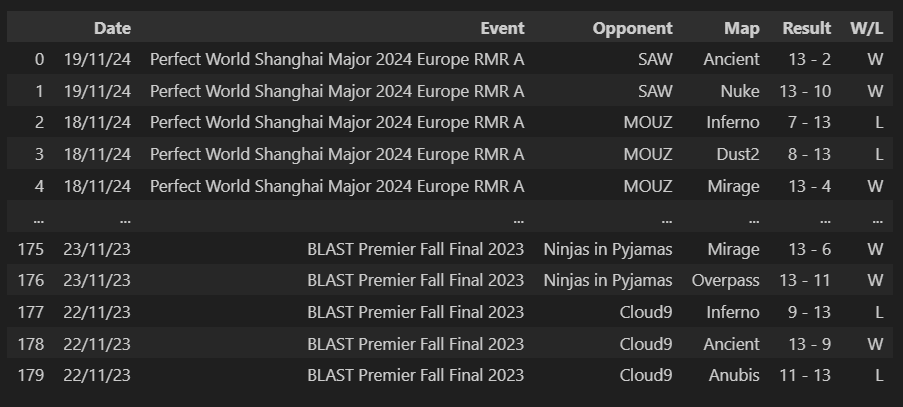
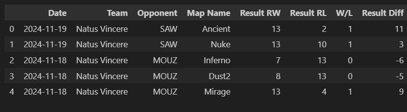
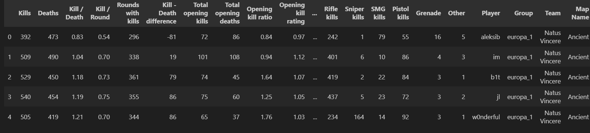
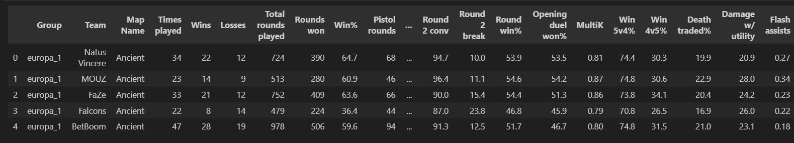

# Datos utilizados

Para este proyecto se utilizaron los datos proporcionados por la página web [HLTV](https://www.hltv.org), la cual recopila todas las estadíticas de los partidos profesionales jugados. Los datos en la página están ordenados y agrupados de forma efectiva y accesible, entre estos datos están las estadísticas completas de los equipos y de sus jugadores, sumado a cada uno de los partidos jugados por todos ellos.

# Extracción de datos

Dado que HLTV no cuenta con una API, tuvimos que utilizar técnicas de web scraping para extraer la información. La utilización de ``cloudscraper`` para pasar la verificación de Cloudflare y ``BeautifulSoup`` para extraer la información de HTML a DataFrames de ``Pandas`` resulto primordial en este proceso.

Se desarrolló la clase `HltvScraper`, que incluye múltiples métodos para la realización de la extracción de manera ordenada. Tenemos:

- **Equipos participantes**: Información de los equipos clasificados para el Major, incluyendo identificadores y nombres.
- **Estadísticas individuales de jugadores**: Datos detallados para cada jugador en diferentes mapas, como estadísticas generales y desempeño en cada uno de los mapas.
- **Estadísticas de equipo por mapa**: Datos agregados sobre el rendimiento de los equipos en mapas específicos.
- **Partidos jugados**: Información detallada de cada partido jugado por los equipos, como fecha, oponente, y resultados.

Ejemplo: matches_played

# Limpieza y trasformación

Los pasos de limpieza y transformación de datos más relevantes fueron:

1. **Eliminación de Datos Incompletos**:  
   En los métodos de extracción de datos (`teams_major_qualifier()`, `individual_stats()`, etc.) del archivo `clase_scraper.py`, se verificó que las respuestas fueran exitosas (es decir, status_code == 200) para asegurar que solo se trabajara con datos válidos.

2. **Conversión de Tipos de Datos**:  
   En `career_player(player)` y `individual_stats(player, map_name)`, se convirtieron columnas de texto a formatos numéricos para así facilitar el analisis.

3. **Transformación de Datos a Formato Tabular**:  
   Los datos extraídos se organizaron en `DataFrames` de `pandas` en métodos como `career_player(player)` y `matches_played(team)` para tener una estructura consistente.

4. **Eliminación de Duplicados**:  
   En los métodos que consolidan información de equipos (`all_teams_stats_by_map()`, `all_matches_played_by_team()`), se eliminaron registros duplicados para garantizar la precisión de los análisis.

5. **Almacenamiento de Datos**:  
   En `guardar_dataframes.ipynb`, los `DataFrames` resultantes se almacenaron en formato `.csv` para asegurar un almacenamiento eficiente y facilitar el análisis posterior.

# Muestra de los Datos

Aqui se muestran ejemplos de los datos almacenados en DataFrames ya limpios:
1. **Datos de Partidos Jugados** (`df_matches`):
   

2. **Datos de Jugadores** (`df_players`):
   

3. **Datos de Equipos** (`df_teams`):
   
