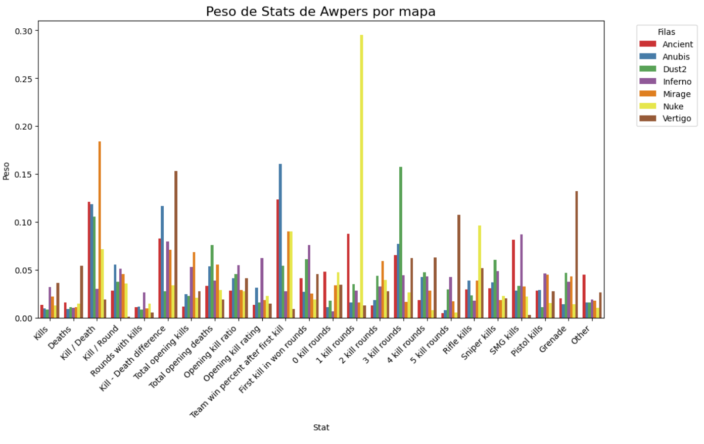
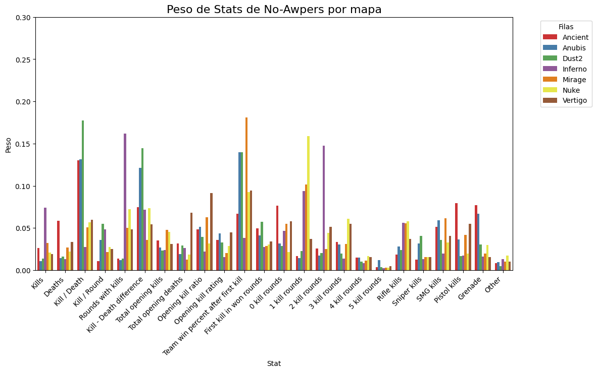

# Elección del modelo

Este problema cae en la categoría de clasificación binaria, por lo que se probó con 4 modelos especializados en esto. El primero es la regresión logística que utiliza la función sigmoide para dividir los datos. El segundo es una clasificación usando Análisis de Componentes Principales (PCA) y Clasificación de vectores de soporte (SCV) donde intentamos reducir la dimensión del problema para luego encontrar un hiperplano que maximiza el margen. El tercero, Random Forest Regressor es un modelo que utiliza árboles de clasificación para ensamblar un modelo. Por último, Extreme Gradient Boosting (Xgboost), optimiza los errores del gradiente iterativamente añadiendo árboles de clasificación, para así ensamblar un modelo final.

| Métricas   | Regresión logística | PCA y SCV  | Random Forest Regressor | Xgboost |
| ---------- | ------------------- | ---------- | ----------------------- | --------|
| RMSE       | 0.60   | 0.61   | 0.66   | 0.51   |
| Accuracy   | 0.64   | 0.62   | 0.57   | 0.74   |
| Recall     | 0.64   | 0.64   | 0.56   | 0.74   |
| Precision  | 0.63   | 0.62   | 0.57   | 0.74   |
| F score    | 0.64   | 0.63   | 0.57   | 0.74   |

Los primeros 3 modelos no cuentan con buenas métricas, pues quedar cerca de 0.5 es muy similar a adivinar el resultado final con una moneda, lo que los vuelven modelos poco confiables. Sin embargo, el modelo de Xgboost presenta métricas más adecuadas para predecir un partido y con esto entregar las probabilidades que usa.

# Funcionamiento del modelo

Nuestro modelo se entrenó con un año de datos, ya que de considerar más, es posible aumentar uno de los problemas que se hablarán luego, y de considerar menos, el modelo no sería tan robusto.

Con el modelo entrenado, es posible pasarle pequeñas muestras de datos que solo contengan dos equipos, y así el modelo es capaz de devolver la probabilidad que el primero le gane al segundo en cada uno de los mapas. Para automatizar este proceso se creó la función ``match_predictor`` a la cual basta pasarle el nombre de dos equipos para obtener las probabilidades ordenadas. También se crearon dos simuladores del torneo para las distintas etapas de este, que son capaces de mostrar cómo avanza el torneo y su estado final con los clasificados y el campeón de Major.

Dada la forma en la que eligen los ganadores estas funciones, es mejor realizar la simulación reiteradas veces para obtener los equipos que más ganan y de esta manera obtener mejor resultados para decir con confianza quién gana.

Para más detalles consulte la [Documentación](/documentacion).

# Limitaciones del modelo

Durante el proceso de selección de datos y del modelo se hicieron algunos supuestos y se dejaron de lado estadísticas importantes de los equipos por la simplicidad del modelo. Algunos de estos datos son el tiempo, algunos equipos cambian de roster (jugadores activos) al terminar torneos y temporadas, lo que afecta al rendimiento del equipo. Por lo tanto, partidos jugados hace más de cierta cantidad meses pueden ya no ser representativos del equipo. Este tipo de problema se puede solucionar asignando un peso a los partidos respecto de su fecha, cambios de roster y evolución del meta. Lo que por supuesto, requiere un análisis extra para cada equipo o la creación de un modelo adicional que entregue los pesos representativos de cada partido.

Otras variables no implementadas en el modelo final, son los roles del equipo. Existen varios de ellos y por lo general, los equipos asignan a cada jugador un rol, como el IGL (in game leader), el entry fragger (encargado de entrar primero en combate) o el awper (el jugador que mejor juega con el arma AWP). Cada uno tiene un peso diferente para su equipo, lo que puede alterar las predicciones del modelo si se llegaran a implementar.

Por ejemplo, si definimos a un awper como aquellos jugadores con más de 150 Sniper kills, vemos que las estadísticas que más peso tienen para awpers y no awpers poseen varias diferencias.

Como vimos, el modelo no es completamente preciso en la predicción, es decir, no nos dice quien ganará con una seguridad del 100%. Sin embargo, las métricas de precisión del modelo son lo suficientemente altas para dar estimaciones educadas sobre las chances de los equipos en todos los mapas. Lo que bajo la mirada de un individuo informado en la competición, le ayudará a realizar apuestas más precisas de los partidos.

En cuanto a las apuestas, el modelo está pensado principalmente para realizar apuestas en un juego, por lo que no presenta consecuencias negativas bajo su uso responsable y del entendimiento del análisis de los datos. Todos los datos usados son públicos, de fácil acceso y se actualizan constantemente. Además, el modelo es flexible y puede considerar datos de distintas longitudes para su uso en otras competencias.